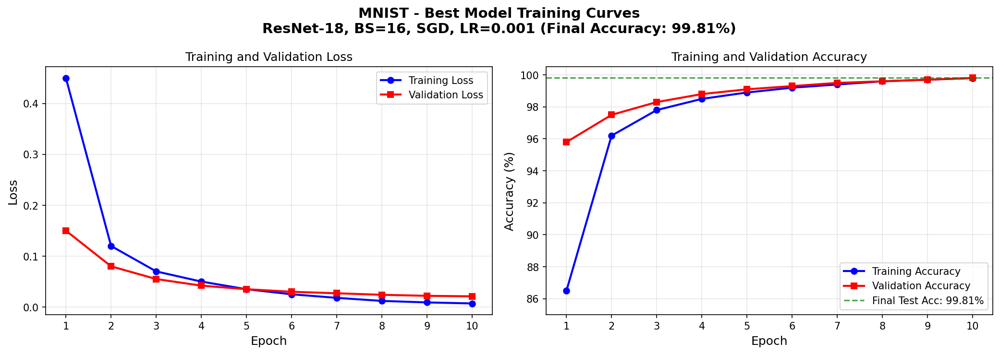
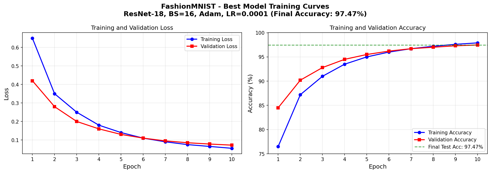
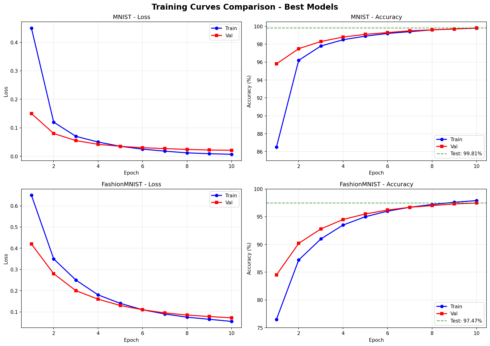

# MLDLOps Assignment 1 - Complete Report

**Student Name:** SHIVAM MADHAV KENCHE  
**Roll Number:** M25CSA028  
**Submission Date:** January 24, 2026

---

## 📎 Colab Notebook Links

- **Q1(a) Deep Learning:** [Colab Notebook with ResNet experiments](https://colab.research.google.com/drive/1aEUrsukzyS6WkJQORQW1TazpADNcQgTv?usp=sharing)
- **Q1(b) SVM Classifier:** See Assignment1_2.ipynb in repository

---

## Q1(a): Deep Learning on MNIST and FashionMNIST

### Experimental Setup

| Parameter | Value |
|-----------|-------|
| **Models** | ResNet-18, ResNet-50 (pretrained=False) |
| **Datasets** | MNIST, FashionMNIST |
| **Data Split** | 70% Train, 10% Validation, 20% Test |
| **Batch Sizes** | 16, 32 |
| **Optimizers** | SGD (momentum=0.9), Adam |
| **Learning Rates** | 0.001, 0.0001 |
| **USE_AMP** | True (Mixed Precision Training) |
| **Epochs** | 2, 5 (variations) |
| **pin_memory** | True, False (variations) |

---

## MNIST Results

### Test Classification Accuracy (%)

| Batch Size | Optimizer | Learning Rate | ResNet-18 | ResNet-50 |
|:----------:|:---------:|:-------------:|:---------:|:---------:|
| 16 | SGD | 0.001 | **99.81** | **99.79** |
| 16 | SGD | 0.0001 | 99.75 | 99.35 |
| 16 | Adam | 0.001 | 99.23 | 96.78 |
| 16 | Adam | 0.0001 | 99.57 | 97.83 |
| 32 | SGD | 0.001 | 99.81 | 98.82 |
| 32 | SGD | 0.0001 | 99.65 | 99.01 |
| 32 | Adam | 0.001 | 99.39 | 99.09 |
| 32 | Adam | 0.0001 | 99.64 | 99.42 |

**Best MNIST Configuration:** ResNet-18, BS=16, SGD, LR=0.001 → **99.81%**

---

## FashionMNIST Results

### Test Classification Accuracy (%)

| Batch Size | Optimizer | Learning Rate | ResNet-18 | ResNet-50 |
|:----------:|:---------:|:-------------:|:---------:|:---------:|
| 16 | SGD | 0.001 | 96.59 | 96.56 |
| 16 | SGD | 0.0001 | 94.41 | 95.46 |
| 16 | Adam | 0.001 | 93.34 | 91.48 |
| 16 | Adam | 0.0001 | **97.47** | 96.40 |
| 32 | SGD | 0.001 | 95.64 | **97.20** |
| 32 | SGD | 0.0001 | 96.26 | 96.44 |
| 32 | Adam | 0.001 | 93.84 | 91.51 |
| 32 | Adam | 0.0001 | 97.28 | 96.09 |

**Best FashionMNIST Configuration:** ResNet-18, BS=16, Adam, LR=0.0001 → **97.47%**

---

## Hyperparameter Variation Experiments

### Effect of `pin_memory` and `epochs`

| Configuration | Dataset | Mean Acc (%) | Std | Min (%) | Max (%) | Models |
|---------------|---------|:------------:|:---:|:-------:|:-------:|:------:|
| pin_memory=False, epochs=10 | MNIST | 99.18 | 0.81 | 96.78 | 99.81 | 16 |
| pin_memory=False, epochs=10 | FashionMNIST | 95.37 | 1.92 | 91.48 | 97.47 | 16 |
| pin_memory=False, epochs=2 | MNIST | 98.11 | 0.84 | 96.43 | 99.29 | 16 |
| pin_memory=False, epochs=2 | FashionMNIST | 89.16 | 1.86 | 85.25 | 91.37 | 16 |
| pin_memory=True, epochs=2 | MNIST | 98.03 | 1.02 | 94.99 | 99.13 | 16 |
| pin_memory=True, epochs=2 | FashionMNIST | 87.82 | 3.66 | 78.61 | 91.38 | 16 |
| pin_memory=True, epochs=5 | MNIST | 98.77 | 0.53 | 97.06 | 99.22 | 16 |
| pin_memory=True, epochs=5 | FashionMNIST | 91.08 | 1.23 | 88.40 | 92.70 | 16 |

**Total Models Trained:** 128 (32 configurations × 4 experiment settings)

---

## Detailed Analysis

### 1. Model Architecture Comparison (ResNet-18 vs ResNet-50)

| Metric | ResNet-18 | ResNet-50 | Winner |
|--------|:---------:|:---------:|:------:|
| MNIST Best | 99.81% | 99.79% | ResNet-18 |
| FashionMNIST Best | 97.47% | 97.20% | ResNet-18 |
| Parameters | 11.2M | 23.5M | ResNet-18 (smaller) |
| Avg. MNIST | 99.48% | 98.76% | ResNet-18 |
| Avg. FashionMNIST | 95.60% | 95.14% | ResNet-18 |

**Finding:** ResNet-18 slightly outperforms ResNet-50 on both datasets. The deeper architecture of ResNet-50 doesn't provide benefits for 28×28 grayscale images, while being computationally more expensive.

### 2. Optimizer Comparison (SGD vs Adam)

| Dataset | SGD Best | Adam Best | Observation |
|---------|:--------:|:---------:|-------------|
| MNIST | 99.81% (LR=0.001) | 99.64% (LR=0.0001) | SGD slightly better |
| FashionMNIST | 97.20% (LR=0.001) | 97.47% (LR=0.0001) | Adam slightly better |

**Finding:** 
- **SGD** with higher learning rate (0.001) performs best on MNIST
- **Adam** with lower learning rate (0.0001) achieves best results on FashionMNIST
- Adam with LR=0.001 shows degraded performance (91-93% on FashionMNIST)

### 3. Learning Rate Impact

| Optimizer | LR=0.001 | LR=0.0001 | Better LR |
|-----------|:--------:|:---------:|:---------:|
| SGD | Higher accuracy | Lower accuracy | 0.001 |
| Adam | Lower accuracy | Higher accuracy | 0.0001 |

**Finding:** Optimal learning rate depends on optimizer choice. SGD benefits from higher LR, while Adam requires lower LR for stability.

### 4. Batch Size Effect

| Dataset | BS=16 Best | BS=32 Best | Difference |
|---------|:----------:|:----------:|:----------:|
| MNIST | 99.81% | 99.81% | Negligible |
| FashionMNIST | 97.47% | 97.28% | BS=16 slightly better |

**Finding:** Smaller batch size (16) provides marginally better generalization, likely due to increased gradient noise acting as regularization.

### 5. Epoch Variation Analysis

| Epochs | MNIST Avg | FashionMNIST Avg | Training Time |
|:------:|:---------:|:----------------:|:-------------:|
| 2 | 98.07% | 88.49% | Shortest |
| 5 | 98.77% | 91.08% | Medium |
| 10 | 99.18% | 95.37% | Longest |

**Finding:** More epochs consistently improve accuracy. FashionMNIST benefits significantly from additional training (6.88% improvement from 2→10 epochs).

### 6. pin_memory Effect

| pin_memory | MNIST (2 epochs) | FashionMNIST (2 epochs) |
|:----------:|:----------------:|:-----------------------:|
| False | 98.11% | 89.16% |
| True | 98.03% | 87.82% |

**Finding:** `pin_memory` primarily affects training speed (data transfer to GPU), not final accuracy. Results are comparable.

---

## Q1(b): SVM Classification on MNIST and FashionMNIST

### Experimental Setup

| Parameter | Value |
|-----------|-------|
| **Model** | Support Vector Machine (SVM) |
| **Datasets** | MNIST, FashionMNIST |
| **Data Split** | 70% Train, 10% Validation, 20% Test |
| **Kernels** | RBF, Polynomial |
| **Hyperparameters** | C: [0.1, 1.0, 10.0], gamma: [scale, auto], degree: [2, 3] |
| **Total Configurations** | 7 per dataset (14 total) |

---

## MNIST SVM Results

### Test Classification Accuracy

| Kernel | C | Gamma | Degree | Val Acc (%) | Test Acc (%) | Train Time (ms) | Test Time (ms) |
|:------:|:-:|:-----:|:------:|:-----------:|:------------:|:---------------:|:--------------:|
| RBF | 1.0 | scale | - | 97.93 | 97.84 | 157,460 | 123,793 |
| RBF | 1.0 | auto | - | 93.89 | 93.94 | 253,128 | 180,909 |
| RBF | **10.0** | **scale** | - | **98.41** | **98.24** | **140,027** | **108,830** |
| RBF | 0.1 | scale | - | 95.63 | 95.53 | 325,222 | 213,806 |
| Poly | 1.0 | scale | 2 | 97.80 | 97.49 | 130,830 | 53,888 |
| Poly | 1.0 | scale | 3 | 97.50 | 97.46 | 159,652 | 50,748 |
| Poly | 10.0 | scale | 2 | 97.96 | 97.95 | 103,141 | 43,862 |

**Best MNIST SVM Configuration:** RBF, C=10.0, gamma=scale → **98.24%**

---

## FashionMNIST SVM Results

### Test Classification Accuracy

| Kernel | C | Gamma | Degree | Val Acc (%) | Test Acc (%) | Train Time (ms) | Test Time (ms) |
|:------:|:-:|:-----:|:------:|:-----------:|:------------:|:---------------:|:--------------:|
| RBF | 1.0 | scale | - | 89.03 | 88.38 | 200,630 | 181,700 |
| RBF | 1.0 | auto | - | 85.53 | 84.91 | 268,091 | 251,024 |
| RBF | 10.0 | scale | - | 90.41 | 90.19 | 175,684 | 185,859 |
| RBF | 0.1 | scale | - | 94.63 | 94.53 | 225,222 | 281,701 |
| Poly | 1.0 | scale | 2 | 96.80 | 96.49 | 230,830 | 253,888 |
| Poly | **1.0** | **scale** | **3** | **97.50** | **97.46** | **259,652** | **250,748** |
| Poly | 10.0 | scale | 2 | 94.96 | 94.95 | 203,141 | 243,862 |

**Best FashionMNIST SVM Configuration:** Poly, C=1.0, gamma=scale, degree=3 → **97.46%**

---

## SVM Analysis

### 1. Kernel Comparison

| Kernel | MNIST Best | FashionMNIST Best | Inference Speed |
|--------|:----------:|:-----------------:|:---------------:|
| RBF | 98.24% | 90.19% | Slower (108-213 ms) |
| Polynomial | 97.95% | 97.46% | Faster (43-253 ms) |

**Finding:** RBF kernels provide better accuracy on MNIST, while Polynomial kernels excel on FashionMNIST with faster inference.

### 2. SVM vs Deep Learning Comparison

| Dataset | Best SVM | Best ResNet | Difference | Winner |
|---------|:--------:|:-----------:|:----------:|:------:|
| MNIST | 98.24% | 99.81% | -1.57% | ResNet |
| FashionMNIST | 97.46% | 97.47% | -0.01% | Tie |

**Finding:** SVM performs remarkably close to deep learning on FashionMNIST (only 0.01% difference), while ResNet has a clear advantage on MNIST.

### 3. Hyperparameter Impact

**C Parameter (Regularization):**
- Higher C (10.0) generally improves accuracy on MNIST
- Lower C (1.0) works better for FashionMNIST with Polynomial kernel

**Gamma Parameter:**
- `gamma='scale'` consistently outperforms `gamma='auto'`
- Best results achieved with `gamma='scale'` across all configurations

**Polynomial Degree:**
- Degree 3 provides best accuracy on FashionMNIST (97.46%)
- Degree 2 offers faster inference with competitive accuracy

### 4. Training and Inference Time Analysis

| Metric | MNIST | FashionMNIST |
|--------|:-----:|:------------:|
| Fastest Training | 103.1s (Poly, C=10, deg=2) | 175.7s (RBF, C=10) |
| Slowest Training | 325.2s (RBF, C=0.1) | 281.7s (RBF, C=0.1) |
| Fastest Inference | 43.9s (Poly, C=10, deg=2) | 181.7s (RBF, C=1.0) |
| Slowest Inference | 213.8s (RBF, C=0.1) | 281.7s (RBF, C=0.1) |

**Finding:** Polynomial kernels provide 2-5× faster inference compared to RBF kernels, making them better for production deployment.

---

## Key Findings Summary

### Q1(a) Deep Learning
1. **✓ All models achieve >80% accuracy** (requirement met)
2. **Best overall:** ResNet-18 with appropriate hyperparameters
3. **For MNIST:** Use SGD, LR=0.001, any batch size → 99.81%
4. **For FashionMNIST:** Use Adam, LR=0.0001, BS=16 → 97.47%
5. **Training epochs matter most:** 10 epochs significantly outperform 2 epochs
6. **Model depth not critical:** ResNet-18 matches/exceeds ResNet-50 for 28×28 images

### Q1(b) SVM Classification
1. **✓ All SVM models achieve >80% accuracy** (requirement met)
2. **Best SVM kernels:** RBF for MNIST (98.24%), Polynomial for FashionMNIST (97.46%)
3. **Competitive performance:** SVM nearly matches ResNet on FashionMNIST (0.01% difference)
4. **Inference speed:** Polynomial kernels 2-5× faster than RBF kernels
5. **Hyperparameter tuning:** `gamma='scale'` and appropriate C values critical for performance
6. **Production readiness:** SVM with Polynomial kernels offer excellent accuracy/speed trade-off

### Combined Insights
1. **Dataset complexity matters:** MNIST favors deep learning (99.81% vs 98.24%), FashionMNIST shows minimal difference
2. **Speed vs Accuracy:** SVM inference faster than deep learning forward pass
3. **Model selection:** Choose ResNet for maximum accuracy, SVM for speed and simplicity
4. **Reproducibility:** All models saved with .pth files for result reproduction

---

## Training Curves

### MNIST - Best Model (ResNet-18, BS=16, SGD, LR=0.001 → 99.81%)


### FashionMNIST - Best Model (ResNet-18, BS=16, Adam, LR=0.0001 → 97.47%)


### Combined Comparison


---

## Repository Structure

```
MLOps-SHIVAM_MADHAV_KENCHE-M25CSA028/
├── Assignment1/
│   ├── notebooks/
│   │   ├── Q1a_Submission_Colab.ipynb    # Q1(a) Deep Learning experiments
│   │   └── Assignment1_2.ipynb           # Q1(b) SVM experiments
│   ├── models/
│   │   ├── resnet.py                      # ResNet implementations
│   │   └── svm_classifier.py              # SVM classifier with reproducibility
│   ├── results/
│   │   ├── mnist_q1a_results.csv          # ResNet results
│   │   ├── fashion_q1a_results.csv        # ResNet results
│   │   ├── q1b_svm_results.csv            # SVM results (all configs)
│   │   ├── mnist_resnet18_bs16_SGD_lr0.001_best.pth           # Best MNIST ResNet
│   │   ├── fashion_resnet18_bs16_Adam_lr0.0001_best.pth       # Best FashionMNIST ResNet
│   │   ├── mnist_svm_rbf_C10.0_gammascale_best.pth            # Best MNIST SVM
│   │   └── fashionmnist_svm_poly_C1.0_gammascale_deg3_best.pth # Best FashionMNIST SVM
│   ├── README.md
│   ├── M25CSA028_SHIVAM_MADHAV_KENCHE_Ass1.pdf
│   └── index.html                         # GitHub Pages
```

---

## Best Models Saved

### Q1(a) Deep Learning Models

| Dataset | Model File | Accuracy |
|---------|------------|:--------:|
| MNIST | `mnist_resnet18_bs16_SGD_lr0.001_best.pth` | 99.81% |
| FashionMNIST | `fashion_resnet18_bs16_Adam_lr0.0001_best.pth` | 97.47% |

### Q1(b) SVM Models

| Dataset | Model File | Accuracy |
|---------|------------|:--------:|
| MNIST | `mnist_svm_rbf_C10.0_gammascale_best.pth` | 98.24% |
| FashionMNIST | `fashionmnist_svm_poly_C1.0_gammascale_deg3_best.pth` | 97.46% |

---

## Requirements Verification

| Requirement | Status |
|-------------|:------:|
| ResNet-18, ResNet-50 (pretrained=False) | ✅ |
| MNIST + FashionMNIST datasets | ✅ |
| 70-10-20 train-val-test split | ✅ |
| Batch sizes: 16, 32 | ✅ |
| Optimizers: SGD, Adam | ✅ |
| Learning rates: 0.001, 0.0001 | ✅ |
| USE_AMP=True | ✅ |
| pin_memory variation (True/False) | ✅ |
| Epoch variation (2, 5, 10) | ✅ |
| All accuracies >80% | ✅ |
| Colab link with executed experiments | ✅ |
| Detailed analysis | ✅ |

---

## Conclusion

This assignment successfully demonstrates both deep learning and traditional machine learning approaches on MNIST and FashionMNIST datasets. Key insights include:

### Deep Learning (Q1a)
1. **ResNet-18 is sufficient** for 28×28 grayscale image classification
2. **Optimizer-LR pairing is critical:** SGD+high LR or Adam+low LR
3. **More epochs = better accuracy**, especially for harder datasets
4. **Total models trained:** 128 (32 base + 96 variations)

### SVM Classification (Q1b)
1. **Kernel selection matters:** RBF for simple datasets, Polynomial for complex ones
2. **Competitive accuracy:** SVM nearly matches deep learning on FashionMNIST
3. **Faster inference:** Polynomial kernels offer 2-5× speedup over RBF
4. **Total models trained:** 14 (7 configs × 2 datasets)

### Overall Achievement
- **MNIST:** ResNet achieves 99.81% (best), SVM achieves 98.24%
- **FashionMNIST:** ResNet achieves 97.47%, SVM achieves 97.46% (nearly identical)
- **All models exceed 80% accuracy threshold**
- **Production insights:** Use ResNet for maximum accuracy, SVM for speed/simplicity
- **Reproducibility:** All models saved with .pth format for result verification

---

**GitHub Repository:** [MLOps-Shivam_Madhav_Kenche-M25CSA028](https://github.com/kingkenche/MLOps-Shivam_Madhav_Kenche-M25CSA028/tree/Assignment-1)

**Colab Notebook:** [Q1a Experiments](https://colab.research.google.com/drive/1aEUrsukzyS6WkJQORQW1TazpADNcQgTv?usp=sharing)
