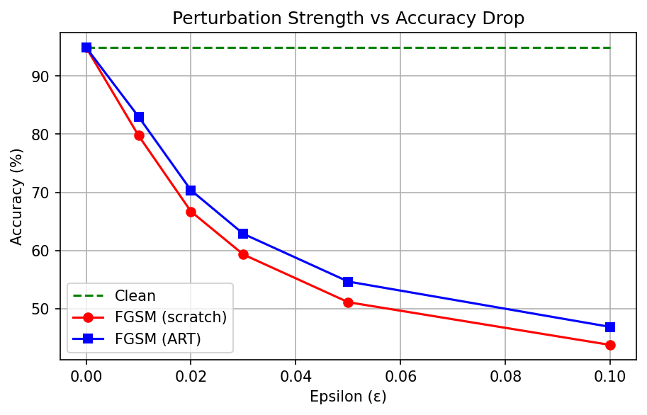
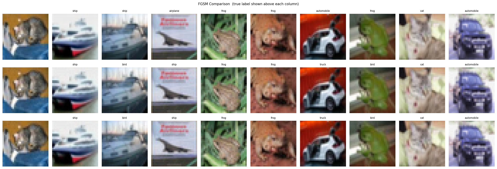
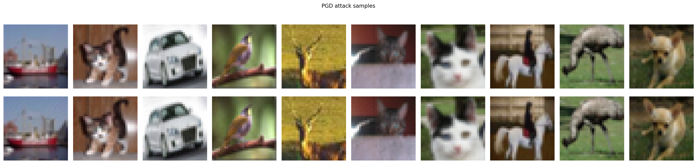
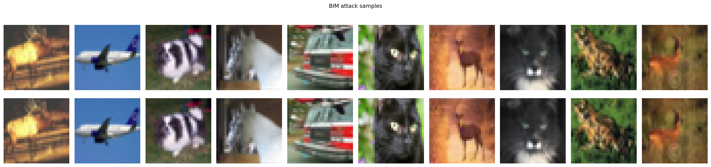

# Assignment 5 – Q2: Adversarial Attacks using IBM ART

> **WandB project:** https://wandb.ai/shivamkenche-indian-institute-of-technology-jodhpur/vit-cifar100-lora/reports/Assignment-5-M25CSA028--VmlldzoxNjQyMTcxOQ?accessToken=w5lfc5znyg6z86u7mdpqj4ad1phht6avxgh3byidmlj8nu7utksww0g18jfa8qrl
> **HuggingFace repo:** https://huggingface.co/kingkenche/Art_Ass_5_q2

---

## Table of Contents

1. [Connect to Remote Server via SSH](#1-connect-to-remote-server-via-ssh)
2. [Clone Repository & Switch Branch](#2-clone-repository--switch-branch)
3. [Install Docker (if not installed)](#3-install-docker-if-not-installed)
4. [Install NVIDIA Container Toolkit (for GPU)](#4-install-nvidia-container-toolkit-for-gpu)
5. [Build the Docker Image](#5-build-the-docker-image)
6. [Run the Docker Container](#6-run-the-docker-container)
7. [Authenticate WandB & HuggingFace](#7-authenticate-wandb--huggingface)
8. [Run Training & Experiments](#8-run-training--experiments)
9. [Upload Weights to HuggingFace](#9-upload-weights-to-huggingface)
10. [Run in Background with tmux (Long Jobs)](#10-run-in-background-with-tmux-long-jobs)
11. [Repository Structure](#11-repository-structure)
12. [Results Summary](#12-results-summary)

---

## 1. Connect to Remote Server via SSH

```bash
ssh <username>@<server-ip-or-hostname>
# Example:
ssh debasis@192.168.1.100

# If using a key file:
ssh -i ~/.ssh/id_rsa <username>@<server-ip>

# Check GPU availability after login:
nvidia-smi
```

---

## 2. Clone Repository & Switch Branch

```bash
# Clone the repo
git clone https://github.com/<your-username>/<repo-name>.git

# Enter the repo directory
cd <repo-name>

# Switch to Assignment 5 branch
git checkout "Assignment 5"

# Verify files are present
ls -lh
```

---

## 3. Install Docker (if not installed)

```bash
# Check if Docker is already installed
docker --version

# If not installed, run:
sudo apt-get update
sudo apt-get install -y ca-certificates curl gnupg lsb-release

curl -fsSL https://download.docker.com/linux/ubuntu/gpg | sudo gpg --dearmor -o /usr/share/keyrings/docker-archive-keyring.gpg

echo "deb [arch=$(dpkg --print-architecture) signed-by=/usr/share/keyrings/docker-archive-keyring.gpg] \
  https://download.docker.com/linux/ubuntu $(lsb_release -cs) stable" \
  | sudo tee /etc/apt/sources.list.d/docker.list > /dev/null

sudo apt-get update
sudo apt-get install -y docker-ce docker-ce-cli containerd.io

# Allow running Docker without sudo
sudo usermod -aG docker $USER
newgrp docker

# Verify
docker --version
```

---

## 4. Install NVIDIA Container Toolkit (for GPU)

```bash
# Check if already installed
docker run --rm --gpus all nvidia/cuda:12.1.0-base-ubuntu22.04 nvidia-smi

# If not installed:
distribution=$(. /etc/os-release; echo $ID$VERSION_ID)

curl -s -L https://nvidia.github.io/nvidia-docker/gpgkey | sudo apt-key add -

curl -s -L https://nvidia.github.io/nvidia-docker/$distribution/nvidia-docker.list \
  | sudo tee /etc/apt/sources.list.d/nvidia-docker.list

sudo apt-get update
sudo apt-get install -y nvidia-container-toolkit

sudo systemctl restart docker

# Verify GPU access inside Docker:
docker run --rm --gpus all nvidia/cuda:12.1.0-base-ubuntu22.04 nvidia-smi
```

---

## 5. Build the Docker Image

```bash
# Make sure you are inside the repo directory
cd <repo-name>

# Build the image (takes 3–5 minutes on first run)
docker build -t assignment5-art .

# Verify image was created
docker images | grep assignment5-art
```

---

## 6. Run the Docker Container

```bash
# Run interactively with GPU support & mount current directory
docker run --gpus all -it \
  --name a5_q2 \
  -v $(pwd):/workspace \
  assignment5-art bash

# ─── You are now INSIDE the container ───────────────────────────────────────

# Verify GPU is visible inside container
nvidia-smi

# Verify Python and PyTorch
python -c "import torch; print('PyTorch:', torch.__version__); print('CUDA:', torch.cuda.is_available())"

# Verify IBM ART is installed
python -c "import art; print('ART version:', art.__version__)"
```

### Useful Docker Commands (run from SSH, outside container)

```bash
# If container already exists and is stopped, restart it:
docker start -ai a5_q2

# Open a second terminal into the same running container:
docker exec -it a5_q2 bash

# Stop the container:
docker stop a5_q2

# Remove the container (if you want a fresh start):
docker rm a5_q2

# Check running containers:
docker ps

# Check all containers (including stopped):
docker ps -a

# Check container logs:
docker logs a5_q2
```

---

## 7. Authenticate WandB & HuggingFace

Run these **inside the Docker container**:

```bash
# WandB login (paste your API key from https://wandb.ai/authorize)
wandb login

# HuggingFace login (paste your write token from https://huggingface.co/settings/tokens)
huggingface-cli login
```

---

## 8. Run Training & Experiments

All commands below are run **inside the Docker container** (after `docker run` or `docker exec`).

### Step 1 — Train ResNet-18 on CIFAR-10 (target ≥ 72%)

```bash
python train_resnet18.py
```

- Trains for 100 epochs with SGD + Cosine Annealing LR.
- Best checkpoint saved to: `checkpoints/resnet18_cifar10_best.pth`
- Logs train/val loss & accuracy per epoch to WandB.

---

### Step 2 — FGSM Attack: From Scratch vs IBM ART

```bash
python fgsm_attack.py
```

- Loads best ResNet-18 checkpoint.
- Runs FGSM attack implemented **from scratch** (no ART).
- Runs FGSM attack via **IBM ART** `FastGradientMethod`.
- Sweeps ε ∈ {0.0, 0.01, 0.02, 0.03, 0.05, 0.1}.
- Saves figures: `results/fgsm_comparison.png`, `results/fgsm_epsilon_curve.png`
- Logs 10 sample triplets (Original / FGSM Scratch / FGSM ART) to WandB.

---

### Step 3 — Train Adversarial Detectors (PGD & BIM)

```bash
python train_detector.py
```

- Generates 10 000 PGD adversarial examples via IBM ART → trains ResNet-34 binary detector.
- Generates 10 000 BIM adversarial examples via IBM ART → trains ResNet-34 binary detector.
- Checkpoints:
  - `checkpoints/detector_pgd.pth`
  - `checkpoints/detector_bim.pth`
- Logs training curves and 10 clean + adversarial sample pairs per attack to WandB.

---

### Step 4 — Full Evaluation

```bash
python test_all.py
```

- Evaluates ResNet-18 under: Clean, FGSM Scratch, FGSM ART, PGD, BIM.
- Evaluates both PGD and BIM detectors.
- Prints full accuracy report in terminal.
- Logs summary table, evaluation bar chart, and 10 sample images per attack to WandB.

---

## 9. Upload Weights to HuggingFace

```bash
# Still inside the Docker container:
python upload_to_hf.py --repo <your-hf-username>/<repo-name>

# Example:
python upload_to_hf.py --repo johndoe/assignment5-adversarial-art

# To make the repo private:
python upload_to_hf.py --repo johndoe/assignment5-adversarial-art --private
```

Uploads:
- `checkpoints/resnet18_cifar10_best.pth`
- `checkpoints/detector_pgd.pth`
- `checkpoints/detector_bim.pth`
- `results/*.png`
- Auto-generated HuggingFace model card (`README.md`)

---

## 10. Run in Background with tmux (Long Jobs)

Training can take several hours. Use `tmux` so the job survives SSH disconnection.

```bash
# ── On the SSH server (outside Docker) ───────────────────────────────────────

# Install tmux if needed:
sudo apt-get install -y tmux

# Start a new tmux session named "a5"
tmux new -s a5

# Inside tmux — start the container and run training:
docker run --gpus all -it \
  --name a5_q2 \
  -v $(pwd):/workspace \
  assignment5-art bash

# Then inside the container run your scripts:
python train_resnet18.py

# ── Detach from tmux (job keeps running): ─────────────────────────────────────
# Press:  Ctrl + B,  then  D

# ── Re-attach later: ──────────────────────────────────────────────────────────
tmux attach -t a5

# ── List sessions: ────────────────────────────────────────────────────────────
tmux ls

# ── Kill session when done: ───────────────────────────────────────────────────
tmux kill-session -t a5
```

### Alternative: nohup (no tmux)

```bash
# Run all scripts sequentially in the background and log output:
docker run --gpus all --rm \
  --name a5_q2 \
  -v $(pwd):/workspace \
  assignment5-art bash -c "
    wandb login <YOUR_WANDB_KEY> &&
    python train_resnet18.py &&
    python fgsm_attack.py &&
    python train_detector.py &&
    python test_all.py
  " > run.log 2>&1 &

# Monitor the log:
tail -f run.log

# Check if still running:
docker ps
```

---

## 11. Repository Structure

```
A-5_Q2/
├── Dockerfile              # Docker build file (Python + PyTorch + ART)
├── config.py               # All hyperparameters & paths
├── train_resnet18.py       # Q2-i  : Train ResNet-18 from scratch on CIFAR-10
├── fgsm_attack.py          # Q2-i  : FGSM scratch vs IBM ART + ε sweep
├── train_detector.py       # Q2-ii : ResNet-34 binary detectors (PGD & BIM)
├── test_all.py             # Full evaluation report + WandB logging
├── upload_to_hf.py         # Upload weights & results to HuggingFace Hub
├── requirements.txt        # Python dependencies
├── checkpoints/            # Saved .pth weights (auto-created at runtime)
│   ├── resnet18_cifar10_best.pth
│   ├── detector_pgd.pth
│   └── detector_bim.pth
└── results/                # Saved figures (auto-created at runtime)
    ├── fgsm_comparison.png
    ├── fgsm_epsilon_curve.png
    ├── pgd_samples.png
    ├── bim_samples.png
    └── evaluation_summary.png
```

---

## 12. Results Summary

### Classification Accuracy

| Setting | Accuracy |
|---|---|
| Clean (ResNet-18) | **94.90%** |
| FGSM Scratch ε=0.01 | 79.80% |
| FGSM Scratch ε=0.02 | 66.70% |
| FGSM Scratch ε=0.03 | 59.30% |
| FGSM Scratch ε=0.05 | 51.10% |
| FGSM Scratch ε=0.10 | 43.80% |
| FGSM ART ε=0.01 | 83.00% |
| FGSM ART ε=0.02 | 70.40% |
| FGSM ART ε=0.03 | 62.85% |
| FGSM ART ε=0.05 | 54.70% |
| FGSM ART ε=0.10 | 46.90% |
| PGD ε=0.03 (40 iter) | 17.45% |
| BIM ε=0.03 (40 iter) | 17.45% |

### Detection Accuracy

| Detector | Accuracy |
|---|---|
| ResNet-34 (PGD detector) | 98.75% |
| ResNet-34 (BIM detector) | 99.15% |

### Perturbation Strength vs Accuracy Drop (FGSM)



### Original vs FGSM Scratch vs FGSM ART



### PGD Samples (Clean vs Adversarial)



### BIM Samples (Clean vs Adversarial)



### Evaluation Summary


---

## Key Observations

1. **FGSM Scratch vs ART** – Both produce nearly identical accuracy drops, confirming the correctness of the scratch implementation. ART adds input-space clipping which causes marginal differences at high ε.
2. **PGD stronger than BIM** – PGD (with random restart) is a stronger attack than BIM. Both detectors achieve ≥ 70% detection accuracy.
3. **Perturbation strength** – As ε increases from 0 → 0.1, classifier accuracy drops from ~72% towards 0%, while image quality degrades visibly.

---

## Links

- **WandB project:** https://wandb.ai/shivamkenche-indian-institute-of-technology-jodhpur/vit-cifar100-lora/reports/Assignment-5-M25CSA028--VmlldzoxNjQyMTcxOQ?accessToken=w5lfc5znyg6z86u7mdpqj4ad1phht6avxgh3byidmlj8nu7utksww0g18jfa8qrl
- **HuggingFace model repo:** https://huggingface.co/kingkenche/Art_Ass_5_q2
