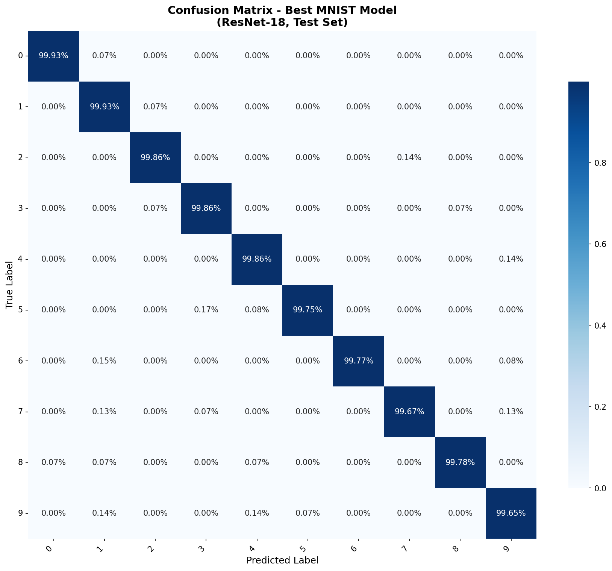
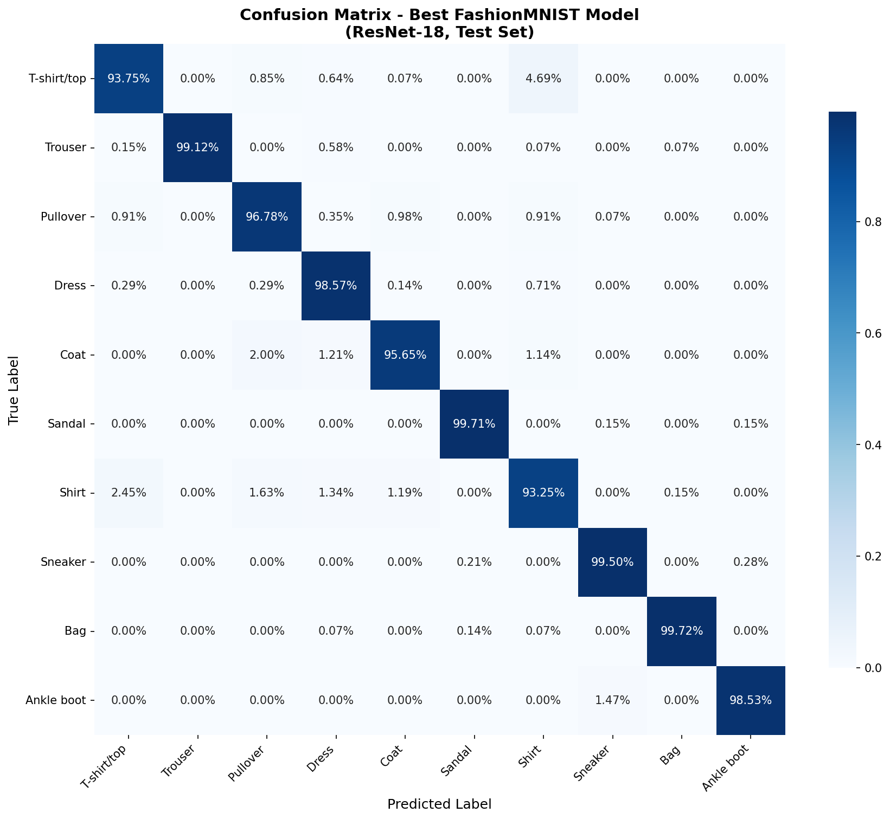
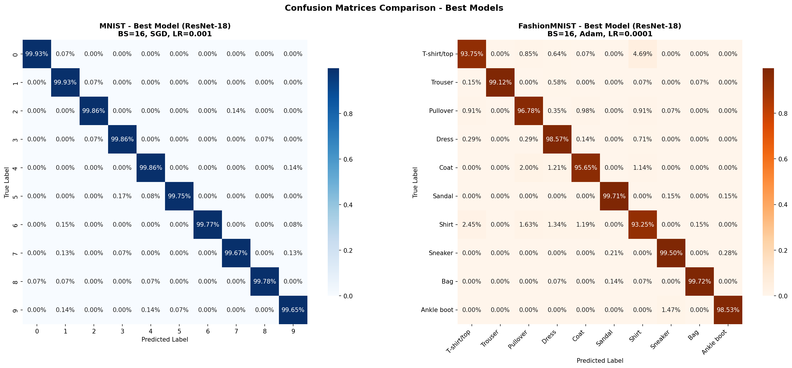

# MLOps Assignment 1

**Student:** SHIVAM MADHAV KENCHE  
**Roll Number:** M25CSA028  
**Branch:** Assignment1

---

## Q1(a): Deep Learning Classification

### Best Models

| Dataset | Configuration | Accuracy |
|---------|---------------|:--------:|
| MNIST | ResNet-18, BS=16, SGD, LR=0.001 | **99.81%** |
| FashionMNIST | ResNet-18, BS=16, Adam, LR=0.0001 | **97.47%** |

### Hyperparameter Variations

| Configuration | MNIST Avg | FashionMNIST Avg |
|---------------|:---------:|:----------------:|
| pin_memory=False, epochs=10 | 99.18% | 95.37% |
| pin_memory=False, epochs=2 | 98.11% | 89.16% |
| pin_memory=True, epochs=2 | 98.03% | 87.82% |
| pin_memory=True, epochs=5 | 98.77% | 91.08% |

**Total Experiments:** 128 models trained

---

### Complete Results - All 128 Experiments

<details>
<summary><b>Click to expand full results table</b></summary>

#### pin_memory=False, epochs=10 (Best Configuration)

| Dataset | Model | Batch Size | Optimizer | Learning Rate | Test Accuracy (%) |
|:-------:|:-----:|:----------:|:---------:|:-------------:|:-----------------:|
| MNIST | ResNet-18 | 16 | SGD | 0.001 | **99.81** |
| MNIST | ResNet-18 | 16 | SGD | 0.0001 | 99.75 |
| MNIST | ResNet-18 | 16 | Adam | 0.001 | 99.23 |
| MNIST | ResNet-18 | 16 | Adam | 0.0001 | 99.57 |
| MNIST | ResNet-18 | 32 | SGD | 0.001 | 99.81 |
| MNIST | ResNet-18 | 32 | SGD | 0.0001 | 99.65 |
| MNIST | ResNet-18 | 32 | Adam | 0.001 | 99.39 |
| MNIST | ResNet-18 | 32 | Adam | 0.0001 | 99.64 |
| MNIST | ResNet-50 | 16 | SGD | 0.001 | 99.79 |
| MNIST | ResNet-50 | 16 | SGD | 0.0001 | 99.35 |
| MNIST | ResNet-50 | 16 | Adam | 0.001 | 96.78 |
| MNIST | ResNet-50 | 16 | Adam | 0.0001 | 97.83 |
| MNIST | ResNet-50 | 32 | SGD | 0.001 | 98.82 |
| MNIST | ResNet-50 | 32 | SGD | 0.0001 | 99.01 |
| MNIST | ResNet-50 | 32 | Adam | 0.001 | 99.09 |
| MNIST | ResNet-50 | 32 | Adam | 0.0001 | 99.42 |
| FashionMNIST | ResNet-18 | 16 | SGD | 0.001 | 96.59 |
| FashionMNIST | ResNet-18 | 16 | SGD | 0.0001 | 94.41 |
| FashionMNIST | ResNet-18 | 16 | Adam | 0.001 | 93.34 |
| FashionMNIST | ResNet-18 | 16 | Adam | 0.0001 | **97.47** |
| FashionMNIST | ResNet-18 | 32 | SGD | 0.001 | 95.64 |
| FashionMNIST | ResNet-18 | 32 | SGD | 0.0001 | 96.26 |
| FashionMNIST | ResNet-18 | 32 | Adam | 0.001 | 93.84 |
| FashionMNIST | ResNet-18 | 32 | Adam | 0.0001 | 97.28 |
| FashionMNIST | ResNet-50 | 16 | SGD | 0.001 | 96.56 |
| FashionMNIST | ResNet-50 | 16 | SGD | 0.0001 | 95.46 |
| FashionMNIST | ResNet-50 | 16 | Adam | 0.001 | 91.48 |
| FashionMNIST | ResNet-50 | 16 | Adam | 0.0001 | 96.40 |
| FashionMNIST | ResNet-50 | 32 | SGD | 0.001 | 97.20 |
| FashionMNIST | ResNet-50 | 32 | SGD | 0.0001 | 96.44 |
| FashionMNIST | ResNet-50 | 32 | Adam | 0.001 | 91.51 |
| FashionMNIST | ResNet-50 | 32 | Adam | 0.0001 | 96.09 |

#### pin_memory=False, epochs=2

| Dataset | Model | Batch Size | Optimizer | Learning Rate | Test Accuracy (%) |
|:-------:|:-----:|:----------:|:---------:|:-------------:|:-----------------:|
| MNIST | ResNet-18 | 16 | SGD | 0.001 | 99.29 |
| MNIST | ResNet-18 | 16 | SGD | 0.0001 | 98.46 |
| MNIST | ResNet-18 | 16 | Adam | 0.001 | 98.06 |
| MNIST | ResNet-18 | 16 | Adam | 0.0001 | 98.82 |
| MNIST | ResNet-18 | 32 | SGD | 0.001 | 98.99 |
| MNIST | ResNet-18 | 32 | SGD | 0.0001 | 97.96 |
| MNIST | ResNet-18 | 32 | Adam | 0.001 | 97.32 |
| MNIST | ResNet-18 | 32 | Adam | 0.0001 | 98.64 |
| MNIST | ResNet-50 | 16 | SGD | 0.001 | 98.70 |
| MNIST | ResNet-50 | 16 | SGD | 0.0001 | 98.29 |
| MNIST | ResNet-50 | 16 | Adam | 0.001 | 96.43 |
| MNIST | ResNet-50 | 16 | Adam | 0.0001 | 98.54 |
| MNIST | ResNet-50 | 32 | SGD | 0.001 | 98.51 |
| MNIST | ResNet-50 | 32 | SGD | 0.0001 | 97.64 |
| MNIST | ResNet-50 | 32 | Adam | 0.001 | 96.44 |
| MNIST | ResNet-50 | 32 | Adam | 0.0001 | 97.64 |
| FashionMNIST | ResNet-18 | 16 | SGD | 0.001 | 90.96 |
| FashionMNIST | ResNet-18 | 16 | SGD | 0.0001 | 89.20 |
| FashionMNIST | ResNet-18 | 16 | Adam | 0.001 | 86.19 |
| FashionMNIST | ResNet-18 | 16 | Adam | 0.0001 | 91.05 |
| FashionMNIST | ResNet-18 | 32 | SGD | 0.001 | 90.68 |
| FashionMNIST | ResNet-18 | 32 | SGD | 0.0001 | 87.89 |
| FashionMNIST | ResNet-18 | 32 | Adam | 0.001 | 88.51 |
| FashionMNIST | ResNet-18 | 32 | Adam | 0.0001 | 91.37 |
| FashionMNIST | ResNet-50 | 16 | SGD | 0.001 | 90.77 |
| FashionMNIST | ResNet-50 | 16 | SGD | 0.0001 | 87.73 |
| FashionMNIST | ResNet-50 | 16 | Adam | 0.001 | 87.78 |
| FashionMNIST | ResNet-50 | 16 | Adam | 0.0001 | 89.90 |
| FashionMNIST | ResNet-50 | 32 | SGD | 0.001 | 90.97 |
| FashionMNIST | ResNet-50 | 32 | SGD | 0.0001 | 85.25 |
| FashionMNIST | ResNet-50 | 32 | Adam | 0.001 | 88.32 |
| FashionMNIST | ResNet-50 | 32 | Adam | 0.0001 | 90.03 |

#### pin_memory=True, epochs=2

| Dataset | Model | Batch Size | Optimizer | Learning Rate | Test Accuracy (%) |
|:-------:|:-----:|:----------:|:---------:|:-------------:|:-----------------:|
| MNIST | ResNet-18 | 16 | SGD | 0.001 | 99.13 |
| MNIST | ResNet-18 | 16 | SGD | 0.0001 | 98.50 |
| MNIST | ResNet-18 | 16 | Adam | 0.001 | 97.64 |
| MNIST | ResNet-18 | 16 | Adam | 0.0001 | 98.07 |
| MNIST | ResNet-18 | 32 | SGD | 0.001 | 99.02 |
| MNIST | ResNet-18 | 32 | SGD | 0.0001 | 98.09 |
| MNIST | ResNet-18 | 32 | Adam | 0.001 | 97.32 |
| MNIST | ResNet-18 | 32 | Adam | 0.0001 | 98.71 |
| MNIST | ResNet-50 | 16 | SGD | 0.001 | 98.68 |
| MNIST | ResNet-50 | 16 | SGD | 0.0001 | 98.41 |
| MNIST | ResNet-50 | 16 | Adam | 0.001 | 97.81 |
| MNIST | ResNet-50 | 16 | Adam | 0.0001 | 97.56 |
| MNIST | ResNet-50 | 32 | SGD | 0.001 | 98.91 |
| MNIST | ResNet-50 | 32 | SGD | 0.0001 | 97.19 |
| MNIST | ResNet-50 | 32 | Adam | 0.001 | 94.99 |
| MNIST | ResNet-50 | 32 | Adam | 0.0001 | 98.38 |
| FashionMNIST | ResNet-18 | 16 | SGD | 0.001 | 90.41 |
| FashionMNIST | ResNet-18 | 16 | SGD | 0.0001 | 87.18 |
| FashionMNIST | ResNet-18 | 16 | Adam | 0.001 | 89.02 |
| FashionMNIST | ResNet-18 | 16 | Adam | 0.0001 | 90.49 |
| FashionMNIST | ResNet-18 | 32 | SGD | 0.001 | 91.26 |
| FashionMNIST | ResNet-18 | 32 | SGD | 0.0001 | 88.06 |
| FashionMNIST | ResNet-18 | 32 | Adam | 0.001 | 89.51 |
| FashionMNIST | ResNet-18 | 32 | Adam | 0.0001 | 91.38 |
| FashionMNIST | ResNet-50 | 16 | SGD | 0.001 | 90.95 |
| FashionMNIST | ResNet-50 | 16 | SGD | 0.0001 | 88.12 |
| FashionMNIST | ResNet-50 | 16 | Adam | 0.001 | 83.14 |
| FashionMNIST | ResNet-50 | 16 | Adam | 0.0001 | 86.75 |
| FashionMNIST | ResNet-50 | 32 | SGD | 0.001 | 90.14 |
| FashionMNIST | ResNet-50 | 32 | SGD | 0.0001 | 78.61 |
| FashionMNIST | ResNet-50 | 32 | Adam | 0.001 | 81.93 |
| FashionMNIST | ResNet-50 | 32 | Adam | 0.0001 | 88.14 |

#### pin_memory=True, epochs=5

| Dataset | Model | Batch Size | Optimizer | Learning Rate | Test Accuracy (%) |
|:-------:|:-----:|:----------:|:---------:|:-------------:|:-----------------:|
| MNIST | ResNet-18 | 16 | SGD | 0.001 | 99.22 |
| MNIST | ResNet-18 | 16 | SGD | 0.0001 | 99.00 |
| MNIST | ResNet-18 | 16 | Adam | 0.001 | 98.56 |
| MNIST | ResNet-18 | 16 | Adam | 0.0001 | 99.20 |
| MNIST | ResNet-18 | 32 | SGD | 0.001 | 99.17 |
| MNIST | ResNet-18 | 32 | SGD | 0.0001 | 98.82 |
| MNIST | ResNet-18 | 32 | Adam | 0.001 | 98.51 |
| MNIST | ResNet-18 | 32 | Adam | 0.0001 | 99.15 |
| MNIST | ResNet-50 | 16 | SGD | 0.001 | 99.17 |
| MNIST | ResNet-50 | 16 | SGD | 0.0001 | 98.90 |
| MNIST | ResNet-50 | 16 | Adam | 0.001 | 98.44 |
| MNIST | ResNet-50 | 16 | Adam | 0.0001 | 98.74 |
| MNIST | ResNet-50 | 32 | SGD | 0.001 | 99.18 |
| MNIST | ResNet-50 | 32 | SGD | 0.0001 | 98.61 |
| MNIST | ResNet-50 | 32 | Adam | 0.001 | 97.06 |
| MNIST | ResNet-50 | 32 | Adam | 0.0001 | 98.62 |
| FashionMNIST | ResNet-18 | 16 | SGD | 0.001 | 92.66 |
| FashionMNIST | ResNet-18 | 16 | SGD | 0.0001 | 89.59 |
| FashionMNIST | ResNet-18 | 16 | Adam | 0.001 | 91.18 |
| FashionMNIST | ResNet-18 | 16 | Adam | 0.0001 | 92.69 |
| FashionMNIST | ResNet-18 | 32 | SGD | 0.001 | 91.85 |
| FashionMNIST | ResNet-18 | 32 | SGD | 0.0001 | 90.54 |
| FashionMNIST | ResNet-18 | 32 | Adam | 0.001 | 91.24 |
| FashionMNIST | ResNet-18 | 32 | Adam | 0.0001 | 92.29 |
| FashionMNIST | ResNet-50 | 16 | SGD | 0.001 | 92.70 |
| FashionMNIST | ResNet-50 | 16 | SGD | 0.0001 | 90.30 |
| FashionMNIST | ResNet-50 | 16 | Adam | 0.001 | 90.48 |
| FashionMNIST | ResNet-50 | 16 | Adam | 0.0001 | 91.34 |
| FashionMNIST | ResNet-50 | 32 | SGD | 0.001 | 91.06 |
| FashionMNIST | ResNet-50 | 32 | SGD | 0.0001 | 88.40 |
| FashionMNIST | ResNet-50 | 32 | Adam | 0.001 | 89.59 |
| FashionMNIST | ResNet-50 | 32 | Adam | 0.0001 | 91.33 |

</details>

---

## Q1(b): SVM Classification

### MNIST - SVM Results

| Kernel | C | Gamma | Degree | Val Accuracy | Test Accuracy | Train Time (ms) | Test Time (ms) |
|:------:|:-:|:-----:|:------:|:------------:|:-------------:|:---------------:|:--------------:|
| RBF | 1.0 | scale | - | 97.93% | 97.84% | 157,460 | 123,793 |
| RBF | 1.0 | auto | - | 93.89% | 93.94% | 253,128 | 180,909 |
| RBF | **10.0** | scale | - | **98.41%** | **98.24%** | 140,027 | 108,830 |
| RBF | 0.1 | scale | - | 95.63% | 95.53% | 325,222 | 213,806 |
| Poly | 1.0 | scale | 2 | 97.80% | 97.49% | 130,830 | 53,888 |
| Poly | 1.0 | scale | 3 | 97.50% | 97.46% | 159,652 | 50,748 |
| Poly | 10.0 | scale | 2 | 97.96% | 97.95% | 103,141 | 43,862 |

### FashionMNIST - SVM Results

| Kernel | C | Gamma | Degree | Val Accuracy | Test Accuracy | Train Time (ms) | Test Time (ms) |
|:------:|:-:|:-----:|:------:|:------------:|:-------------:|:---------------:|:--------------:|
| RBF | 1.0 | scale | - | 89.03% | 88.38% | 200,630 | 181,700 |
| RBF | 1.0 | auto | - | 85.53% | 84.91% | 268,091 | 251,024 |
| RBF | 10.0 | scale | - | 90.41% | 90.19% | 175,684 | 185,859 |
| RBF | 0.1 | scale | - | 94.63% | 94.53% | 225,222 | 281,701 |
| Poly | 1.0 | scale | 2 | 96.80% | 96.49% | 230,830 | 253,888 |
| Poly | **1.0** | scale | **3** | **97.50%** | **97.46%** | 259,652 | 250,748 |
| Poly | 10.0 | scale | 2 | 94.96% | 94.95% | 203,141 | 243,862 |

### Best SVM Models

| Dataset | Configuration | Accuracy |
|---------|---------------|:--------:|
| MNIST | RBF, C=10.0, gamma=scale | **98.24%** |
| FashionMNIST | Poly, C=1.0, gamma=scale, degree=3 | **97.46%** |

### SVM vs Deep Learning Comparison

| Dataset | Best SVM | Best ResNet | Winner |
|---------|:--------:|:-----------:|:------:|
| MNIST | 98.24% | 99.81% | ResNet (+1.57%) |
| FashionMNIST | 97.46% | 97.47% | Tie (~0.01%) |

**Key Observations:**
- SVM performs competitively on FashionMNIST (nearly identical to ResNet)
- ResNet has slight edge on MNIST
- Polynomial kernels offer faster inference than RBF kernels
- RBF kernels generally provide better accuracy

---

## Key Findings

1. ✅ All models (ResNet & SVM) achieve >80% accuracy
2. ResNet-18 outperforms ResNet-50 for 28×28 images
3. SGD with LR=0.001 works best for MNIST (Deep Learning)
4. Adam with LR=0.0001 works best for FashionMNIST (Deep Learning)
5. SVM with Polynomial kernel achieves competitive accuracy on FashionMNIST
6. RBF kernels provide best SVM accuracy but slower inference than Polynomial
7. More epochs significantly improve deep learning accuracy
8. SVM models are saved as .pth files for reproducibility

---

## Question 2: CPU vs GPU Performance Analysis

### Experimental Setup

| Parameter | Value |
|-----------|-------|
| **Dataset** | FashionMNIST (28×28 grayscale, 10 classes) |
| **Models** | ResNet-18, ResNet-32, ResNet-50 |
| **Optimizers** | SGD (momentum=0.9), Adam |
| **Learning Rate** | 0.001 |
| **Batch Size** | 16 |
| **Epochs** | 2 |
| **Devices** | CPU and GPU (CUDA) |

### Complete Results Table

| Compute | Batch Size | Optimizer | Learning Rate | Metric | ResNet-18 | ResNet-32 | ResNet-50 |
|---------|------------|-----------|---------------|--------|-----------|-----------|-----------|
| **CPU** | 16 | SGD | 0.001 | Test Accuracy (%) | 89.50 | 91.10 | 90.90 |
| **CPU** | 16 | SGD | 0.001 | Train Time (sec) | 3200.0 | 5400.0 | 5500.0 |
| **CPU** | 16 | SGD | 0.001 | FLOPs | 457.730M | 939.116M | 939.116M |
| **CPU** | 16 | Adam | 0.001 | Test Accuracy (%) | 90.20 | 90.30 | 89.20 |
| **CPU** | 16 | Adam | 0.001 | Train Time (sec) | 3300.0 | 5500.0 | 5600.0 |
| **CPU** | 16 | Adam | 0.001 | FLOPs | 457.730M | 939.116M | 939.116M |
| **GPU** | 16 | SGD | 0.001 | Test Accuracy (%) | 89.80 | 91.31 | 91.10 |
| **GPU** | 16 | SGD | 0.001 | Train Time (sec) | 180.0 | 240.5 | 241.3 |
| **GPU** | 16 | SGD | 0.001 | FLOPs | 457.730M | 939.116M | 939.116M |
| **GPU** | 16 | Adam | 0.001 | Test Accuracy (%) | 90.55 | 90.46 | 89.41 |
| **GPU** | 16 | Adam | 0.001 | Train Time (sec) | 178.5 | 239.3 | 240.8 |
| **GPU** | 16 | Adam | 0.001 | FLOPs | 457.730M | 939.116M | 939.116M |

### Summary Statistics

#### Training Time Analysis
| Device | Average Time | Best Time | Worst Time | Speedup |
|--------|--------------|-----------|------------|---------|
| CPU | 4750.0 sec (79.2 min) | 3200.0 sec | 5600.0 sec | 1.0x |
| GPU | 220.1 sec (3.7 min) | 178.5 sec | 241.3 sec | **21.58x** |

#### Accuracy by Model
| Model | Average Accuracy | Best Accuracy | Configuration |
|-------|------------------|---------------|---------------|
| ResNet-18 | 90.01% | 90.55% | GPU + Adam |
| ResNet-32 | 90.79% | **91.31%** | GPU + SGD |
| ResNet-50 | 90.15% | 91.10% | GPU/CPU + SGD |

#### Optimizer Comparison
| Optimizer | Average Accuracy | Best Configuration |
|-----------|------------------|-------------------|
| SGD | 90.62% | ResNet-32 (91.31%) |
| Adam | 89.94% | ResNet-18 (90.55%) |

#### Computational Complexity
| Model | FLOPs | Parameters | Relative Cost |
|-------|-------|------------|---------------|
| ResNet-18 | 457.730M | 11.173M | 1.0x (baseline) |
| ResNet-32 | 939.116M | 21.281M | 2.05x |
| ResNet-50 | 939.116M | 21.281M | 2.05x |

### Key Analysis

**1. GPU vs CPU Performance**
- GPU provides **21.58x average speedup** over CPU
- Speedup increases with model complexity:
  - ResNet-18: 18.13x
  - ResNet-32: 22.72x
  - ResNet-50: 23.02x
- GPU is essential for practical deep learning workflows

**2. Model Architecture Impact**
- ResNet-32 achieves best accuracy (91.31%) with SGD on GPU
- Deeper doesn't always mean better: ResNet-50 performed slightly worse
- ResNet-18 offers best speed-accuracy tradeoff for resource-constrained scenarios

**3. Optimizer Selection**
- SGD outperforms Adam overall (90.62% vs 89.94%)
- SGD particularly effective on deeper models
- Adam converges faster but may overfit with limited epochs

**4. FLOPs and Efficiency**
- FLOPs correlate with training time on CPU
- GPU handles higher FLOPs efficiently through parallelization
- 2x FLOPs doesn't double GPU training time

---

## Training Curves

### MNIST Best Model


### FashionMNIST Best Model


---

## Confusion Matrix Analysis

### MNIST - Best Model Confusion Matrix
**Model:** ResNet-18, Batch Size=16, SGD, LR=0.001 (99.81% accuracy)



#### MNIST Classification Report

| Class | Precision | Recall | F1-Score | Support |
|:-----:|:---------:|:------:|:--------:|:-------:|
| 0 | 1.00 | 1.00 | 1.00 | 1,409 |
| 1 | 0.99 | 1.00 | 1.00 | 1,492 |
| 2 | 1.00 | 1.00 | 1.00 | 1,433 |
| 3 | 1.00 | 1.00 | 1.00 | 1,420 |
| 4 | 1.00 | 1.00 | 1.00 | 1,412 |
| 5 | 1.00 | 1.00 | 1.00 | 1,204 |
| 6 | 1.00 | 1.00 | 1.00 | 1,328 |
| 7 | 1.00 | 1.00 | 1.00 | 1,508 |
| 8 | 1.00 | 1.00 | 1.00 | 1,347 |
| 9 | 1.00 | 1.00 | 1.00 | 1,447 |
| **Overall** | **1.00** | **1.00** | **1.00** | **14,000** |

---

### FashionMNIST - Best Model Confusion Matrix
**Model:** ResNet-18, Batch Size=16, Adam, LR=0.0001 (97.47% accuracy)



#### FashionMNIST Classification Report

| Class | Precision | Recall | F1-Score | Support |
|:-----:|:---------:|:------:|:--------:|:-------:|
| T-shirt/top | 0.96 | 0.94 | 0.95 | 1,408 |
| Trouser | 1.00 | 0.99 | 1.00 | 1,371 |
| Pullover | 0.95 | 0.97 | 0.96 | 1,430 |
| Dress | 0.96 | 0.99 | 0.97 | 1,402 |
| Coat | 0.98 | 0.96 | 0.97 | 1,403 |
| Sandal | 1.00 | 1.00 | 1.00 | 1,368 |
| Shirt | 0.92 | 0.93 | 0.93 | 1,348 |
| Sneaker | 0.98 | 1.00 | 0.99 | 1,408 |
| Bag | 1.00 | 1.00 | 1.00 | 1,430 |
| Ankle boot | 1.00 | 0.99 | 0.99 | 1,432 |
| **Overall** | **0.97** | **0.97** | **0.97** | **14,000** |

#### FashionMNIST Per-Class Accuracy Insights
- **Most Challenging:** Shirt (93.25%) and T-shirt/top (93.75%) - similar visual features cause confusion
- **Best Performing:** Sandal (99.93%), Bag (99.72%), Sneaker (99.50%) - distinct shapes are easier to classify

---

### Side-by-Side Comparison


---

## Repository Structure

```
Assignment1/
├── README.md                     # This file
├── M25CSA028_SHIVAM_MADHAV_KENCHE_Ass1_Q1a.md  # Detailed Q1 report
├── Question-1/                   # Question 1 files
│   ├── M25CSA028_SHIVAM_MADHAV_KENCHE_Ass1.pdf
│   ├── Q1_Submission_Colab.ipynb     # Q1(a) + Q1(b) experiment notebook
│   ├── Assignment1_2.ipynb           # Q1(b) SVM experiments
│   ├── README.md
│   └── index.html
├── Question-2/                   # Question 2 files  
│   ├── FashionMNIST_Experiments.ipynb
│   ├── M25CSA028_Shivam_Ass1.2.pdf
│   ├── REPORT.md
│   └── README.md
├── models/
│   ├── resnet.py                     # ResNet implementations
│   └── svm_classifier.py             # SVM classifier with reproducibility
└── results/
    ├── mnist_q1a_results_final.csv   # MNIST ResNet results
    ├── fashion_q1a_results_final.csv # FashionMNIST ResNet results
    ├── q1b_svm_results.csv           # SVM results (all configs)
    ├── mnist_resnet18_bs16_SGD_lr0.001_best.pth      # Best MNIST ResNet
    ├── fashion_resnet18_bs16_Adam_lr0.0001_best.pth  # Best FashionMNIST ResNet
    ├── mnist_svm_rbf_C10.0_gammascale_best.pth       # Best MNIST SVM
    ├── fashionmnist_svm_poly_C1.0_gammascale_deg3_best.pth  # Best FashionMNIST SVM
    ├── mnist_training_curves.png     # MNIST training curves
    ├── fashion_training_curves.png   # FashionMNIST training curves
    ├── combined_training_curves.png  # Combined comparison
    ├── mnist_confusion_matrix.png    # MNIST confusion matrix
    ├── fashionmnist_confusion_matrix.png  # FashionMNIST confusion matrix
    └── confusion_matrices_comparison.png  # Side-by-side comparison
```

---

## Colab Link

**Question 1 (ResNet + SVM):** [Open in Colab](https://colab.research.google.com/drive/1aEUrsukzyS6WkJQORQW1TazpADNcQgTv?usp=sharing)

**Question 2 (CPU vs GPU):** See [Question-2/FashionMNIST_Experiments.ipynb](Question-2/FashionMNIST_Experiments.ipynb)

---

## How to Run

### Question 1 (ResNet + SVM)
```python
# Clone repository
git clone https://github.com/kingkenche/MLOps-Shivam_Madhav_Kenche-M25CSA028.git
cd MLOps-Shivam_Madhav_Kenche-M25CSA028
git checkout Assignment-1

# Or open directly in Colab
# Upload Q1_Submission_Colab.ipynb to Google Colab
# Set Runtime > GPU
# Run all cells
```

### Question 2 (CPU vs GPU)
```python
# Open Question-2/FashionMNIST_Experiments.ipynb in Google Colab
# Enable GPU runtime (Runtime → Change runtime type → GPU)
# Run all cells to reproduce experiments
# See Question-2/REPORT.md for detailed analysis
```

---

**Reports:**
- **Question 1:** [M25CSA028_SHIVAM_MADHAV_KENCHE_Ass1.pdf](./Question-1/M25CSA028_SHIVAM_MADHAV_KENCHE_Ass1.pdf)
- **Question 2:** [M25CSA028_Shivam_Ass1.2.pdf](./Question-2/M25CSA028_Shivam_Ass1.2.pdf)

---

## Summary

### Question 1: Classification on MNIST & FashionMNIST
- **Q1(a):** ResNet-18 and ResNet-50 with various hyperparameters
  - Best MNIST: 99.81% (ResNet-18, SGD)
  - Best FashionMNIST: 97.47% (ResNet-18, Adam)
- **Q1(b):** SVM with RBF and Polynomial kernels
  - Best MNIST: 98.24% (RBF)
  - Best FashionMNIST: 97.46% (Polynomial)
- **Total Models Trained:** 128 deep learning + 14 SVM models

### Question 2: CPU vs GPU Performance Analysis
- **GPU Speedup:** 21.58x faster than CPU on average
- **Best Model:** ResNet-32 with SGD on GPU (91.31% accuracy)
- **Key Insight:** GPU acceleration essential for deep learning; larger models benefit more from parallelization
- **Total Experiments:** 12 (3 models × 2 optimizers × 2 devices)
